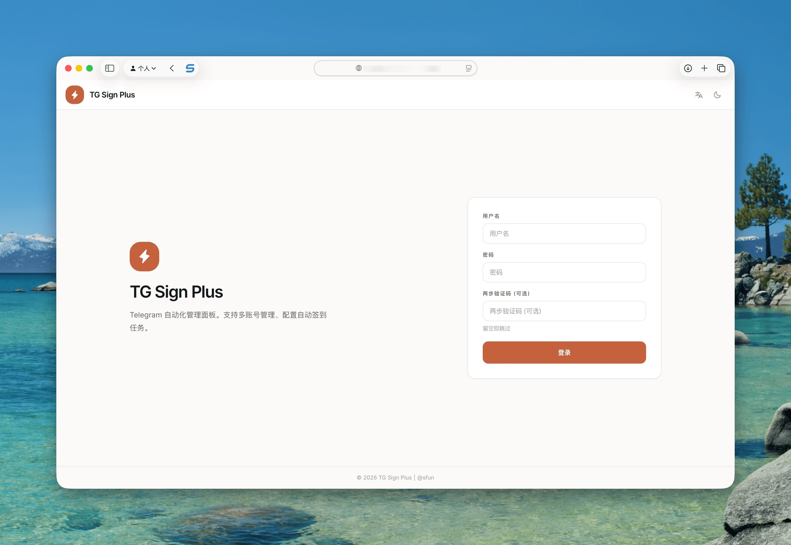
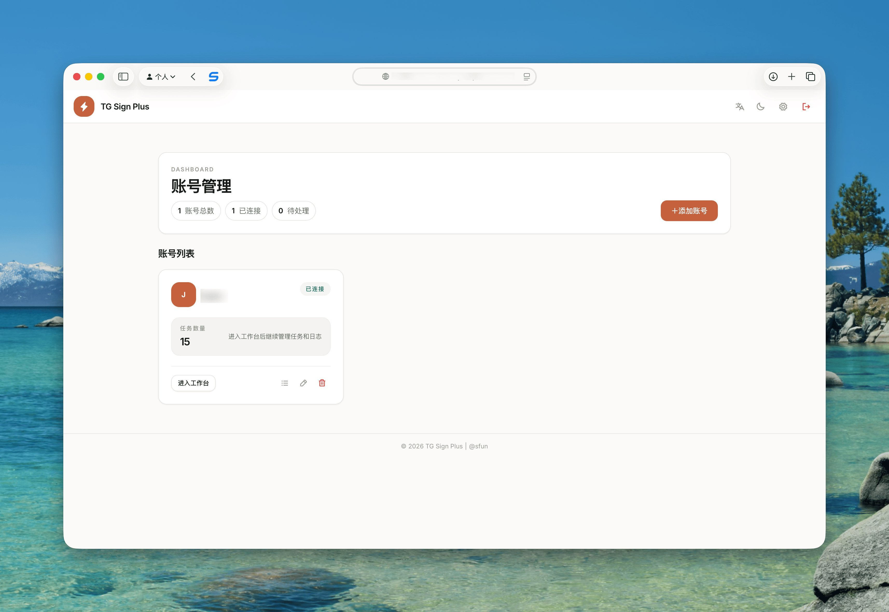
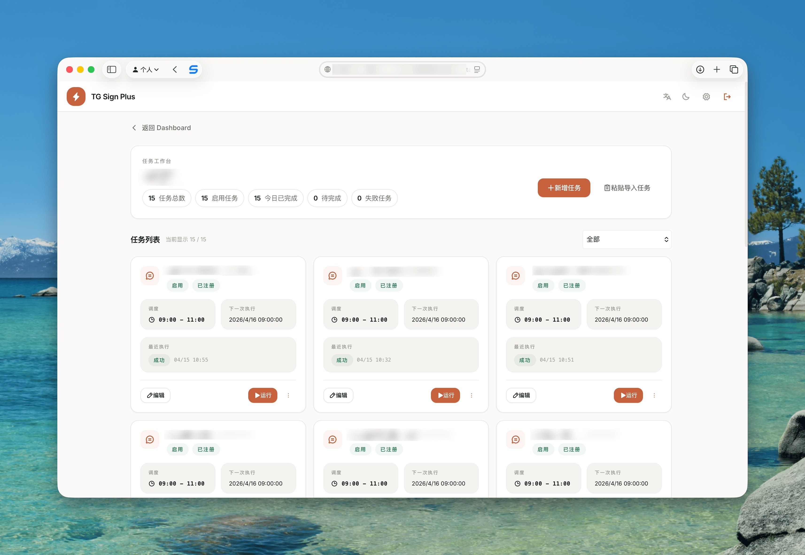

# TG-Sign-Plus

<div align="center">

**功能强大的 Telegram 自动化任务管理平台**

[](LICENSE)
[](https://www.python.org/downloads/)
[](https://fastapi.tiangolo.com/)
[](https://nextjs.org/)

[功能特性](#功能特性) • [快速开始](#快速开始) • [部署方式](#部署方式) • [使用文档](#使用文档) • [配置说明](#配置说明)

</div>

---

## 📖 项目简介

TG-Sign-Plus 是一个基于 Telegram 的自动化任务管理平台，提供 Web 管理界面和 CLI 工具，支持自动签到、消息监控、AI 智能回复等功能。

### 核心能力

- 🤖 **自动化任务执行**：支持定时签到、发送消息、点击按钮等多种自动化操作
- 🧠 **AI 智能处理**：集成 OpenAI API，支持图片识别、计算题求解、诗词填空等 AI 功能
- 📊 **Web 管理界面**：现代化的 Next.js 前端，提供直观的任务配置和监控
- 🔐 **安全认证**：支持 JWT + 双因素认证（2FA/TOTP）
- 📡 **消息监控转发**：实时监控群组/频道消息，支持 UDP/HTTP 转发
- 🐳 **容器化部署**：提供 Docker 镜像，支持一键部署

---

## 📸 项目预览

<div align="center">

### 登录界面


### 控制台


### 任务管理


</div>

---

## ✨ 功能特性

### 自动化任务

- **签到任务**
  - 定时自动签到（支持 Cron 表达式）
  - 多账号、多群组批量管理
  - 随机延迟执行，模拟真实用户行为
  - 支持发送文本、骰子表情、点击按钮等操作

- **AI 增强功能**
  - 图片识别选择选项
  - 自动解答计算题
  - 诗词填空智能匹配
  - 图片文字识别并回复

- **消息监控**
  - 实时监控私聊/群组/频道消息
  - 支持正则表达式、关键词匹配
  - 自动回复或转发到指定聊天
  - 支持 Server酱 推送通知
  - 支持 UDP/HTTP 外部转发

### 管理功能

- **Web 控制台**
  - 账号管理（登录、登出、会话管理）
  - 任务配置（可视化编辑签到流程）
  - 执行历史查看
  - 实时日志监控

- **CLI 工具**
  - 命令行快速操作
  - 批量任务管理
  - 配置导入导出

---

## 🚀 快速开始

### 前置要求

- Python 3.10+
- Node.js 20+（仅开发环境需要）
- Telegram API 凭证（api_id 和 api_hash）

### 获取 Telegram API 凭证

1. 访问 [https://my.telegram.org/apps](https://my.telegram.org/apps)
2. 登录你的 Telegram 账号
3. 创建应用获取 `api_id` 和 `api_hash`

### 本地开发

#### 1. 克隆项目

```bash
git clone https://github.com/ssfun/tg-sign-plus.git
cd tg-sign-plus
```

#### 2. 安装后端依赖

```bash
pip install -e .
```

#### 3. 启动后端服务

```bash
# 设置环境变量
export APP_SECRET_KEY="your-secret-key-here"
export TG_API_ID="your-api-id"
export TG_API_HASH="your-api-hash"

# 启动 FastAPI 服务
uvicorn backend.main:app --host 0.0.0.0 --port 8080
```

#### 4. 启动前端（开发模式）

```bash
cd frontend
npm install
npm run dev
```

访问 `http://localhost:3000` 即可使用 Web 界面。

---

## 🐳 部署方式

### Docker 部署（推荐）

#### 使用 Docker Compose

```bash
# 创建 docker-compose.yml
cat > docker-compose.yml <<EOF
version: '3.8'

services:
  tg-signer:
    image: sfun/tg-sign-plus:latest
    container_name: tg-sign-plus
    ports:
      - "8080:8080"
    volumes:
      - ./data:/data
    environment:
      - APP_SECRET_KEY=your-secret-key-here
      - TG_API_ID=your-api-id
      - TG_API_HASH=your-api-hash
      - TZ=Asia/Shanghai
      # 可选：AI 功能配置
      - OPENAI_API_KEY=your-openai-key
      - OPENAI_BASE_URL=https://api.openai.com/v1
      - OPENAI_MODEL=gpt-4o-mini
    restart: unless-stopped
    healthcheck:
      test: ["CMD", "curl", "-f", "http://localhost:8080/healthz"]
      interval: 30s
      timeout: 5s
      retries: 3
EOF

# 启动服务
docker-compose up -d
```

#### 使用 Docker 命令

```bash
docker run -d \
  --name tg-sign-plus \
  -p 8080:8080 \
  -v $(pwd)/data:/data \
  -e APP_SECRET_KEY=your-secret-key-here \
  -e TG_API_ID=your-api-id \
  -e TG_API_HASH=your-api-hash \
  -e TZ=Asia/Shanghai \
  --restart unless-stopped \
  sfun/tg-sign-plus:latest
```

### 构建自定义镜像

```bash
# 克隆项目
git clone https://github.com/ssfun/tg-sign-plus.git
cd tg-sign-plus

# 构建镜像
docker build -t tg-sign-plus:custom .

# 运行
docker run -d \
  --name tg-sign-plus \
  -p 8080:8080 \
  -v $(pwd)/data:/data \
  -e APP_SECRET_KEY=your-secret-key-here \
  tg-sign-plus:custom
```

---

## 📚 使用文档

### CLI 命令

```bash
# 查看帮助
tg-signer --help

# 登录账号
tg-signer login my_account

# 配置签到任务
tg-signer config my_account my_task

# 执行签到任务
tg-signer run my_account my_task

# 单次执行（不等待定时）
tg-signer run-once my_account my_task

# 配置 AI 模型
tg-signer llm-config

# 发送消息
tg-signer send my_account --chat-id 123456 --text "Hello"

# 查看任务列表
tg-signer list my_account
```

### Web 界面使用

1. **首次登录**
   - 访问 `http://localhost:8080`
   - 使用默认管理员账号登录（首次启动会自动创建）
   - 建议立即修改密码并启用 2FA

2. **添加 Telegram 账号**
   - 进入「账号管理」页面
   - 点击「添加账号」
   - 输入手机号，接收验证码完成登录

3. **配置签到任务**
   - 选择账号，进入「任务管理」
   - 点击「新建任务」
   - 配置签到时间、目标群组、执行动作
   - 保存并启用任务

4. **查看执行历史**
   - 在「任务历史」页面查看执行记录
   - 支持查看详细日志和错误信息

### 签到任务配置示例

#### 简单文本签到

```json
{
  "chats": [
    {
      "chat_id": -1001234567890,
      "name": "示例群组",
      "actions": [
        {
          "action": 1,
          "text": "/签到"
        }
      ],
      "delete_after": 5
    }
  ],
  "sign_at": "0 6 * * *",
  "random_seconds": 300
}
```

#### 带按钮点击的签到

```json
{
  "chats": [
    {
      "chat_id": -1001234567890,
      "actions": [
        {
          "action": 1,
          "text": "/start"
        },
        {
          "action": 3,
          "text": "签到"
        }
      ]
    }
  ],
  "sign_at": "0 8 * * *"
}
```

#### AI 图片识别签到

```json
{
  "chats": [
    {
      "chat_id": -1001234567890,
      "actions": [
        {
          "action": 1,
          "text": "/checkin"
        },
        {
          "action": 4
        }
      ]
    }
  ],
  "sign_at": "0 9 * * *"
}
```

---

## ⚙️ 配置说明

### 环境变量

#### 必需配置

| 变量名 | 说明 | 示例 |
|--------|------|------|
| `APP_SECRET_KEY` | JWT 密钥（生产环境必须设置） | `your-random-secret-key` |
| `TG_API_ID` | Telegram API ID | `12345678` |
| `TG_API_HASH` | Telegram API Hash | `abcdef1234567890` |

#### 可选配置

| 变量名 | 说明 | 默认值 |
|--------|------|--------|
| `PORT` | 服务端口 | `8080` |
| `TZ` | 时区 | `Asia/Shanghai` |
| `BASE_DIR` | 数据目录 | `/data` |
| `DATABASE_URL` | 数据库连接（支持 PostgreSQL） | `sqlite:///data/db.sqlite` |
| `OPENAI_API_KEY` | OpenAI API 密钥 | - |
| `OPENAI_BASE_URL` | OpenAI API 地址 | `https://api.openai.com/v1` |
| `OPENAI_MODEL` | 使用的模型 | `gpt-4o-mini` |
| `SERVER_CHAN_SEND_KEY` | Server酱推送密钥 | - |

### 动作类型说明

| 动作代码 | 说明 | 参数 |
|---------|------|------|
| `1` | 发送文本 | `text`: 要发送的文本 |
| `2` | 发送骰子 | `dice`: 骰子表情（🎲/🎯/🏀/⚽/🎳/🎰） |
| `3` | 点击键盘按钮 | `text`: 按钮文本 |
| `4` | AI 图片识别选择 | 无 |
| `5` | AI 回复计算题 | 无 |
| `6` | AI 图片文字识别 | 无 |
| `7` | AI 计算题点击按钮 | 无 |
| `8` | AI 诗词填空点击按钮 | 无 |
| `9` | 判断签到成功 | `keywords`: 成功关键词列表 |

### Cron 表达式

支持标准 Cron 表达式或简化时间格式：

```bash
# 每天 6:00 执行
0 6 * * *

# 每天 8:30 执行
30 8 * * *

# 每周一 9:00 执行
0 9 * * 1

# 简化格式（自动转换为 Cron）
06:00:00
```

---

## 🔧 高级功能

### 消息监控与转发

```bash
# 配置监控任务
tg-signer monitor my_account my_monitor

# 配置示例：监控群组消息并转发
{
  "match_cfgs": [
    {
      "chat_id": -1001234567890,
      "rule": "contains",
      "rule_value": "关键词",
      "forward_to_chat_id": 123456789,
      "push_via_server_chan": true
    }
  ]
}
```

### AI 自动回复

```bash
# 配置 AI 回复
{
  "chat_id": -1001234567890,
  "rule": "all",
  "ai_reply": true,
  "ai_prompt": "你是一个友好的助手，请简洁回复用户的问题。"
}
```

### 外部系统集成

支持通过 UDP 或 HTTP 转发消息到外部系统：

```json
{
  "external_forwards": [
    {
      "host": "127.0.0.1",
      "port": 9999
    },
    {
      "url": "http://example.com/webhook"
    }
  ]
}
```

---

## 🏗️ 技术架构

### 后端技术栈

- **框架**: FastAPI + Uvicorn
- **数据库**: SQLAlchemy（支持 SQLite/PostgreSQL）
- **任务调度**: APScheduler
- **Telegram 客户端**: Pyrogram (kurigram fork)
- **认证**: JWT + python-jose + pyotp (2FA)
- **限流**: slowapi

### 前端技术栈

- **框架**: Next.js 14 (App Router)
- **UI 库**: React 18 + Tailwind CSS
- **图标**: Phosphor Icons + Lucide React
- **类型**: TypeScript

### 项目结构

```
tg-signer/
├── backend/              # FastAPI 后端
│   ├── api/             # REST API 路由
│   ├── core/            # 核心功能（认证、数据库、配置）
│   ├── models/          # SQLAlchemy 模型
│   ├── services/        # 业务逻辑层
│   ├── repositories/    # 数据访问层
│   ├── scheduler/       # 任务调度
│   └── main.py          # 应用入口
├── frontend/            # Next.js 前端
│   ├── app/            # 页面路由
│   ├── components/     # React 组件
│   ├── lib/            # 工具函数
│   └── context/        # React Context
├── tg_signer/          # Telegram 自动化核心
│   ├── core.py         # 核心逻辑
│   ├── config.py       # 配置模型
│   ├── ai_actions.py   # AI 功能
│   └── __main__.py     # CLI 入口
├── docker/             # Docker 配置
├── Dockerfile          # 镜像构建
└── pyproject.toml      # Python 项目配置
```

---

## 🛡️ 安全建议

1. **生产环境必须设置强密钥**
   ```bash
   # 生成随机密钥
   openssl rand -hex 32
   ```

2. **启用双因素认证（2FA）**
   - 在 Web 界面的「设置」中启用 TOTP
   - 使用 Google Authenticator 等应用扫描二维码

3. **使用 HTTPS**
   - 生产环境建议使用 Nginx 反向代理并配置 SSL 证书

4. **限制访问**
   - 使用防火墙限制端口访问
   - 配置 CORS 白名单

5. **定期备份**
   ```bash
   # 备份数据目录
   tar -czf backup-$(date +%Y%m%d).tar.gz ./data
   ```

---

## 🤝 贡献指南

欢迎提交 Issue 和 Pull Request！

### 开发流程

1. Fork 本仓库
2. 创建特性分支 (`git checkout -b feature/AmazingFeature`)
3. 提交更改 (`git commit -m 'Add some AmazingFeature'`)
4. 推送到分支 (`git push origin feature/AmazingFeature`)
5. 提交 Pull Request

### 代码规范

- Python: 使用 `ruff` 进行代码检查
- TypeScript: 使用 `eslint` 进行代码检查

```bash
# 运行代码检查
ruff check .

# 自动修复
ruff check --fix .
```

---

## 📝 许可证

本项目采用 [BSD-3-Clause License](LICENSE) 开源协议。

---

## 🙏 致谢

- [tg-signer](https://github.com/amchii/tg-signer) by [amchii](https://github.com/amchii) - 本项目基于此项目进行重构与扩展
- [TG-SignPulse](https://github.com/akasls/TG-SignPulse) by [akasls](https://github.com/akasls) - 本项目基于此项目进行重构与扩展
- [Pyrogram](https://github.com/pyrogram/pyrogram) - Telegram MTProto API 客户端
- [FastAPI](https://fastapi.tiangolo.com/) - 现代化的 Python Web 框架
- [Next.js](https://nextjs.org/) - React 应用框架

---

<div align="center">

**如果这个项目对你有帮助，请给个 ⭐️ Star 支持一下！**

</div>
